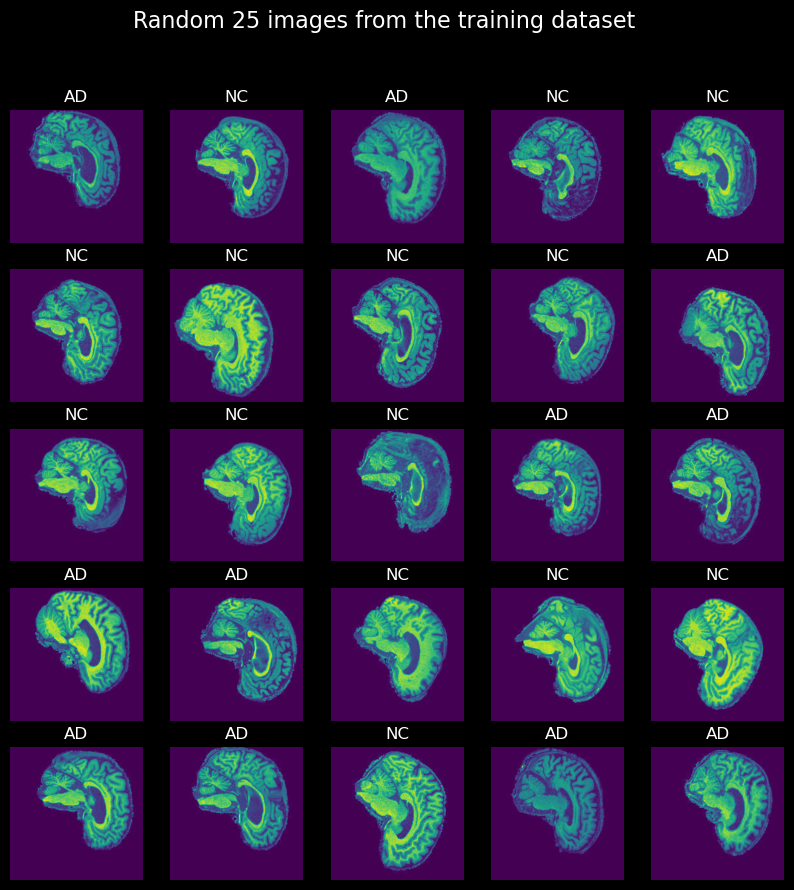

# Using a Vision Transformer to Classify Alzheimer's Disease

## ADNI Brain MRI Dataset
The ADNI Brain dataset consists of a training and testing folder, with each subfolder AD and NC containing a collection of patients that are either positive (AD/Alzheimers group) or negative (NC/Healthy group).



## Vision Transformers
Transformer models are models which uses an 'attention mechanism' to 'remember' previous parts of a sentence, to be able to create complex and coherent sentences and paragraphs. Vision transformers take the same concept but for images instead. This is done by creating embedding vectors of sub-parts of an image, known as a patch. The model then uses an attention mechanism and positional encodings to know where in the image each part belongs.


## Architecture
### Patch Embedding Layer
The Patch Embedding Layer involves taking an input image and splitting into equal sized patches. The patches are then converted to a sequence of learnable embedding vectors. A classification token embeding vector is linearly projected with the learnable embedding vector, which later becomes the embeddings label. Finally, a positional embedding is added to the learnable embedding vectors, so the model knows the origin of each patch within the image and the class.

### Multi Head Self Attention Block
This layer uses an attention mechanism to add weights to the input sequence within parallel to the other heads. This allows the model to 'pay attention' to specific features of interest which positively affect the model. The multiple heads allows the model to pay attention to multiple features. The layer norm layer normalizes the patch embeddings across the embedding dimensions. The multi-head attention layer in three learnable vector forms: query, key and value. These values allow each patch to form a relationship with each other patch in the sequence, allowing it to have self attention.

### Machine Learning Perceptron Block
Perceptrons have a similar architecture to that of neurons in the brain. The perceptrons take a multiple weighted inputs and sum them. They then use an activation function to create outputs. For this models particular case, the model uses a fully connected (linear) layer and a gaussian error linear unit (GELU) activation function with a small amount of mlp dropout.

### Transformer Block
The transformer block is simply a combination of the two above blocks (MSA and MLP) and a feed forward mechanism for the blocks.

## What problem does it solve?
This model attempts to classify Alzheimer's disease from the ADNI mri brain dataset. 

More generally speaking, Vision Transformers have many use cases such as object detection, segmentation, image classification and action recognition.

In comparison to convolutional neural networks (CNNs), Vision Transformers are able to outperform them when contextual understanding is crucial in the task at hand.

## Preprocessing
### Normalization
Finding the mean and standard deviation (std) of the images allows to model to be more effective when training. The mean and std were calculated as ____ and ____ respectively.

### Cropping
As most of the image of the brain scan is black, wasted space, cropping can be added to improve model training. A crop size of 192 was found to be the most effective.

### Resizing
To create patches of an even size, the input image must be square. Therefore, the image must be resized. A size of 256 was found to be the most effective.

### Gray Scale
Since the mri image is grey, pytorch must treat it as if it is such. To do so, the image must be grayscaled so pytorch knows it only has one channel.
## Results
### Data Splitting

### Reproducing results
Create environment using conda
```
conda env create -n <environment_name> -f environment.yml
```
Run the main.py file with the same variables and hyperparameters:
```

```

## References
### Websites
https://www.akshaymakes.com/blogs/vision-transformer?fbclid=IwAR2Wmo7_nlLg2EILO6vsKAYucaTl-AXK7NSGY_LBYTP3aPvU_uWW7iF4dVc

https://medium.com/mlearning-ai/vision-transformers-from-scratch-pytorch-a-step-by-step-guide-96c3313c2e0c

### Images
https://www.google.com/url?sa=i&url=https%3A%2F%2Fwww.researchgate.net%2Ffigure%2FVision-Transformer-architecture-main-blocks-First-image-is-split-into-fixed-size_fig1_357885173&psig=AOvVaw3naQkwUnuyAVqHPmSygFE2&ust=1697694028496000&source=images&cd=vfe&opi=89978449&ved=0CA4QjRxqFwoTCKiBwKPx_oEDFQAAAAAdAAAAABAD

### Papers
https://arxiv.org/pdf/2010.11929.pdf